# Lakekeeper with Keycloak Integration

This project demonstrates the integration of Lakekeeper (an Apache Iceberg catalog service) with Keycloak for authentication and authorization using OpenID Connect (OIDC).

## Overview

This setup provides a complete testing environment for Lakekeeper integrated with:
- **Keycloak** - Identity and Access Management (IAM) provider
- **OpenFGA** - Fine-grained authorization service
- **PostgreSQL** - Database backend for Lakekeeper and OpenFGA
- **MinIO** - S3-compatible object storage
- **Jupyter** - Notebook environment for examples

## Architecture

The integration uses OpenID Connect (OIDC) for authentication:
- Lakekeeper authenticates users via Keycloak
- OpenFGA handles authorization decisions and also authenticates via Keycloak
- All services communicate over a Docker network (`iceberg_net`)

### Architecture Diagram

```mermaid
graph TB
    subgraph "External Access"
        User[👤 Users/Admins]
        Browser[🌐 Web Browser]
        JupyterUI[📓 Jupyter Notebooks<br/>:8888]
    end

    subgraph "Client Applications"
        Spark[⚡ Spark Client]
        Trino[🔍 Trino Client]
        DuckDB[🦆 DuckDB Client]
        StarRocks[⭐ StarRocks Client]
    end

    subgraph "Docker Network: iceberg_net"
        subgraph "Identity & Access Management"
            Keycloak[🔐 Keycloak<br/>:8080<br/>Realm: iceberg<br/>OIDC Provider]
        end

        subgraph "Lakekeeper Services"
            Lakekeeper[🏠 Lakekeeper<br/>:8181<br/>Iceberg Catalog Service]
            Migrate[🔄 Migrate Service<br/>DB Initialization]
        end

        subgraph "Authorization"
            OpenFGA[🛡️ OpenFGA<br/>:8081<br/>Fine-grained AuthZ]
            OpenFGAMigrate[🔄 OpenFGA Migrate<br/>Schema Setup]
        end

        subgraph "Data Storage"
            PostgreSQL[🗄️ PostgreSQL<br/>:5432<br/>Lakekeeper Metadata]
            OpenFGADB[🗄️ PostgreSQL<br/>:5432<br/>OpenFGA Data]
            MinIO[📦 MinIO<br/>:9000<br/>S3-Compatible Storage<br/>Bucket: examples]
            CreateBuckets[🪣 Create Buckets<br/>Initialization]
        end
    end

    %% Authentication Flow
    User -->|Login| Browser
    Browser -->|OIDC Auth| Keycloak
    Spark -->|Client Credentials| Keycloak
    Trino -->|Client Credentials| Keycloak
    DuckDB -->|Client Credentials| Keycloak
    StarRocks -->|Client Credentials| Keycloak
    JupyterUI -->|API Calls| Lakekeeper

    Keycloak -->|JWT Tokens| Lakekeeper
    Keycloak -->|JWT Tokens| OpenFGA
    Keycloak -->|JWT Tokens| Spark
    Keycloak -->|JWT Tokens| Trino
    Keycloak -->|JWT Tokens| DuckDB
    Keycloak -->|JWT Tokens| StarRocks

    %% Authorization Flow
    Lakekeeper -->|Check Permissions| OpenFGA
    OpenFGA -->|AuthZ Decisions| Lakekeeper

    %% Data Flow
    Lakekeeper -->|Read/Write Metadata| PostgreSQL
    OpenFGA -->|Read/Write AuthZ Data| OpenFGADB
    Lakekeeper -->|Manage Iceberg Tables| MinIO
    Spark -->|Query Data| MinIO
    Trino -->|Query Data| MinIO
    DuckDB -->|Query Data| MinIO
    StarRocks -->|Query Data| MinIO

    %% Catalog Access
    Spark -->|Catalog API| Lakekeeper
    Trino -->|Catalog API| Lakekeeper
    DuckDB -->|Catalog API| Lakekeeper
    StarRocks -->|Catalog API| Lakekeeper

    %% Initialization Flow
    Migrate -->|Schema Setup| PostgreSQL
    CreateBuckets -->|Create Buckets| MinIO
    OpenFGAMigrate -->|Schema Setup| OpenFGADB

    %% Bootstrap Process (Notebook 01)
    JupyterUI -.->|1. Get Token| Keycloak
    JupyterUI -.->|2. Bootstrap| Lakekeeper
    JupyterUI -.->|3. Assign Permissions| Lakekeeper
    Lakekeeper -.->|4. Create Users| OpenFGA

    %% Warehouse Creation (Notebook 02)
    JupyterUI -.->|Create Warehouse| Lakekeeper
    Lakekeeper -.->|Configure Storage| MinIO

    %% Styling
    classDef authClass fill:#ff9999,stroke:#333,stroke-width:2px
    classDef serviceClass fill:#99ccff,stroke:#333,stroke-width:2px
    classDef storageClass fill:#99ff99,stroke:#333,stroke-width:2px
    classDef clientClass fill:#ffcc99,stroke:#333,stroke-width:2px

    class Keycloak,OpenFGA authClass
    class Lakekeeper,Migrate,OpenFGAMigrate,CreateBuckets serviceClass
    class PostgreSQL,OpenFGADB,MinIO storageClass
    class Spark,Trino,DuckDB,StarRocks,JupyterUI clientClass
```



### Architecture Overview

#### Core Components

1. **Identity & Access Management**
   - **Keycloak**: OIDC provider that issues JWT tokens
   - **Realm**: `iceberg` realm with pre-configured clients
   - **Clients**: `spark`, `trino`, `duckdb`, `starrocks`, `lakekeeper`, `openfga`

2. **Lakekeeper Services**
   - **Lakekeeper**: Apache Iceberg catalog service (port 8181)
   - **Migrate**: Database schema initialization service

3. **Authorization**
   - **OpenFGA**: Fine-grained authorization service (port 8081)
   - **OpenFGA Migrate**: Authorization schema setup service

4. **Data Storage**
   - **PostgreSQL (Lakekeeper)**: Stores catalog metadata
   - **PostgreSQL (OpenFGA)**: Stores authorization relationship data
   - **MinIO**: S3-compatible object storage with pre-configured `examples` bucket

5. **Client Applications**
   - **Jupyter Notebooks**: Interactive development and examples
   - **Spark, Trino, DuckDB, StarRocks**: Query engines that connect to Lakekeeper

#### Key Processes

**Bootstrap Process (Notebook 01):**
1. Authenticate with Keycloak using client credentials
2. Bootstrap Lakekeeper to create initial admin user
3. Assign permissions (admin, project_admin roles) to users
4. Register query engine clients (trino, duckdb, starrocks)

**Warehouse Creation (Notebook 02):**
1. Authenticate with Keycloak
2. Create warehouse with storage profile configuration
3. Configure MinIO S3 credentials and storage paths
4. Set up warehouse for Iceberg table management

#### Authentication Flow
- All clients authenticate via Keycloak using OIDC protocol
- Keycloak issues JWT tokens with `lakekeeper` audience
- Lakekeeper validates tokens against Keycloak's public keys
- OpenFGA also authenticates via Keycloak for its own operations

#### Authorization Flow
- Lakekeeper queries OpenFGA for permission checks
- OpenFGA uses relationship-based authorization model (ReBAC)
- Permissions are stored in OpenFGA's PostgreSQL database
- Supports fine-grained access control at project, warehouse, and table levels

## Prerequisites

- Docker
- Docker Compose

## Quick Start

### Starting the Services

```bash
docker compose up
```

This will start all services in the correct order with proper health checks and dependencies.

### Service Endpoints

Once all services are running, you can access:

- **Lakekeeper**: http://localhost:8181
- **Keycloak Admin Console**: http://localhost:30080
  - Username: `admin`
  - Password: `admin`
- **Jupyter Notebooks**: http://localhost:8888
- **MinIO Console**: Available on the MinIO service (port 9001 internally)
- **PostgreSQL**: localhost:5432
  - Username: `postgres`
  - Password: `postgres`

## Services

### Lakekeeper
- **Port**: 8181
- **Image**: `quay.io/lakekeeper/catalog:latest-main`
- Configured with OpenID Connect authentication via Keycloak
- Uses OpenFGA for authorization

### Keycloak
- **Port**: 30080 (mapped from internal 8080)
- **Image**: `quay.io/keycloak/keycloak:26.0.7`
- Realm configuration imported from `keycloak/realm.json`
- Features: Token exchange enabled

### OpenFGA
- **Image**: `openfga/openfga:v1.8`
- Configured with OIDC authentication via Keycloak
- Uses PostgreSQL as the datastore

### PostgreSQL
- **Port**: 5432
- **Image**: `postgres:17`
- Two instances: one for Lakekeeper, one for OpenFGA

### MinIO
- **Image**: `minio/minio:RELEASE.2025-07-23T15-54-02Z`
- S3-compatible object storage
- Pre-configured bucket: `examples`

### Jupyter
- **Port**: 8888
- **Image**: `quay.io/jupyter/pyspark-notebook:2024-10-14`
- Notebooks directory mounted at `/home/jovyan/examples/`

## Configuration

### Keycloak Realm
The Keycloak realm configuration is imported from `keycloak/realm.json`. Ensure this file contains your realm configuration before starting the services.

### Environment Variables
Key configuration is set via environment variables in `docker-compose.yaml`:
- `LAKEKEEPER__OPENID_PROVIDER_URI`: Keycloak realm endpoint
- `LAKEKEEPER__OPENID_AUDIENCE`: OIDC audience (`lakekeeper`)
- `LAKEKEEPER__UI__OPENID_CLIENT_ID`: Client ID for UI (`lakekeeper`)

## Usage

1. Start all services: `docker compose up`
2. Wait for all health checks to pass
3. Access Lakekeeper at http://localhost:8181
4. Authenticate using Keycloak credentials
5. Use Jupyter notebooks for examples and testing

## Stopping Services

```bash
docker compose down
```

To remove volumes as well:

```bash
docker compose down -v
```

## Notes

- This is a **testing/development** setup and should not be used in production
- Default passwords and keys are not secure (e.g., `LAKEKEEPER__PG_ENCRYPTION_KEY`)
- Health checks ensure services start in the correct order
- The `migrate` service runs database migrations before Lakekeeper starts
- The `createbuckets` service initializes MinIO buckets before Lakekeeper starts
